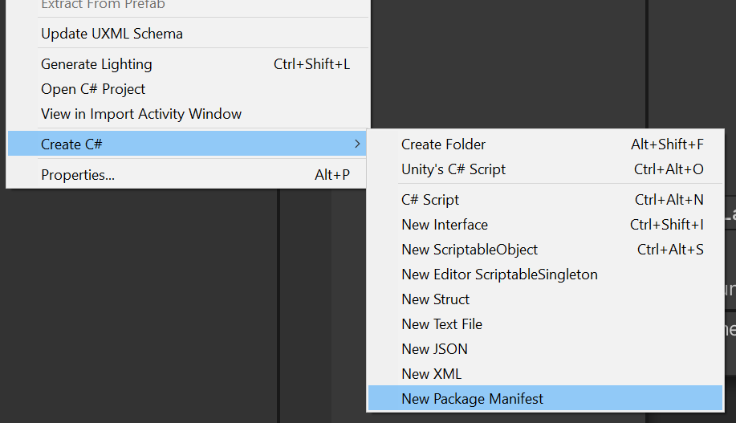
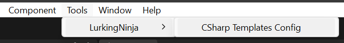
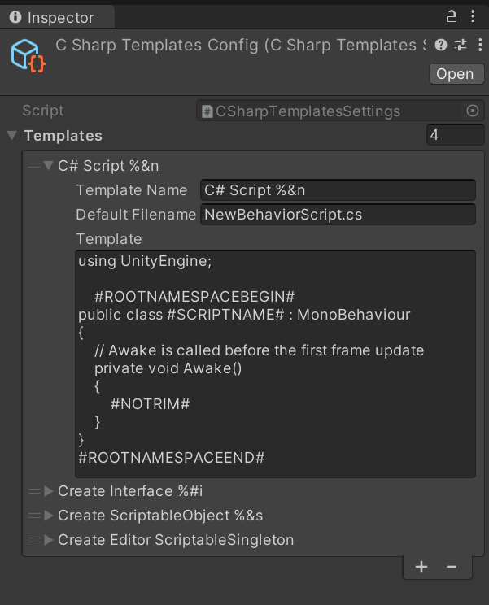

# C# Templates
Adds the following menu and more importantly shortcuts to create folders and files faster.


## Installation
You can choose manually installing the package or from GitHub source.

### Add package from git URL
Use the Package Manager's ```+/Add package from git URL``` function.
The URL you should use is this:
```
https://github.com/LurkingNinja/com.lurking-ninja.csharp-templates.git?path=Packages/com.lurking-ninja.csharp-templates
```

### Manual install
1. Download the latest ```.zip``` package from the [Release](https://github.com/LurkingNinja/com.lurking-ninja.csharp-templates/releases) section.
2. Unpack the ```.zip``` file into your project's ```Packages``` folder.
3. Open your project and check if it is imported properly.

## Usage
Opening the ```Tools/LurkingNinja/CSharp Template Config``` menu point, you will be taken to the settings scriptable object in an Editor folder. This file purely exists in the Editor, won't be inserted into your built game.

In the next screenshot of the Inspector show how you can remove or add new script templates. The package will generate the necessary files to be able to use your newly added template. You will find the new menu points in the same menu, below the built-in ones. You can add shortcuts to the name as usual. See the standard add-on templates as examples. 


## Changelog

### [1.1.2] - 2024-01-04

#### Added

- Struct template
- Txt template
- Json template
- Xml template
- Package Manifest template

[Previous changes](./CHANGELOG.md)