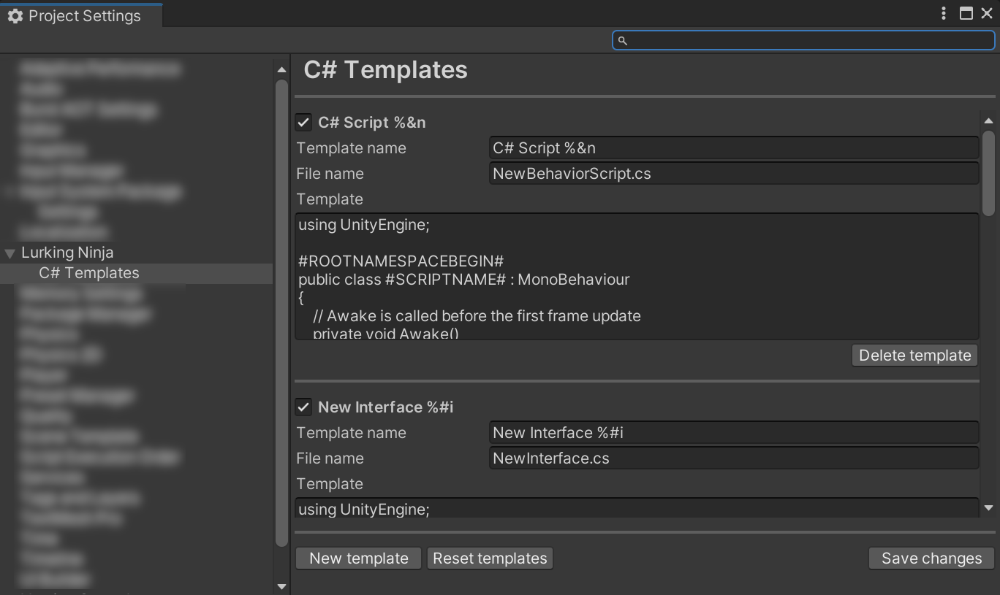

# C# Templates
Adds the following menu and more importantly shortcuts to create folders and files faster.


## Installation
You can choose manually installing the package or from GitHub source.

### Add package from git URL
Use the Package Manager's ```+/Add package from git URL``` function.
The URL you should use is this:
```
https://github.com/LurkingNinja/com.lurking-ninja.csharp-templates.git?path=Packages/com.lurking-ninja.csharp-templates
```

### Manual install
1. Download the latest ```.zip``` package from the [Release](https://github.com/LurkingNinja/com.lurking-ninja.csharp-templates/releases) section.
2. Unpack the ```.zip``` file into your project's ```Packages``` folder.
3. Open your project and check if it is imported properly.

## Usage
Open the ```Project Settings/C# Templates``` tab and edit the templates as needed. The template name is used
as the name of the menu as well in the context menu. You can add [shortcut codes](https://docs.unity3d.com/ScriptReference/MenuItem.html) to the name so Unity will register
those to this function. 


### Usable template variables
There are a few usable template variables Unity can accept.
#### #ROOTNAMESPACEBEGIN#
The beginning of the file, where the ```namespace <namespace> {``` lines go if namespaces are used.
#### #ROOTNAMESPACEEND#
The end of file where the closing ```{``` goes if namespaces are used.
#### #NOTRIM#
The place of the focus.
#### #SCRIPTNAME#
Usually it is the name both of the script and class, you can edit it when you create the file.

## Changelog

## [1.2.0] - 2024-10-24
### Changed
- Settings moved to Project Settings (See Project Settings/C# Templates tab)
### Added
- Individual templates can be enabled or disabled
- Reset templates functionality will delete all previously edited or added templates and restore the built-in ones
### Removed
- Old ScriptableObject based settings stored in Plugins/LurkingNinja/Editor folder

[Previous changes](./CHANGELOG.md)
